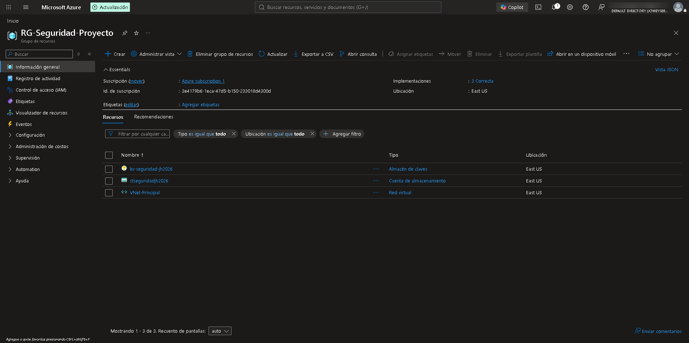
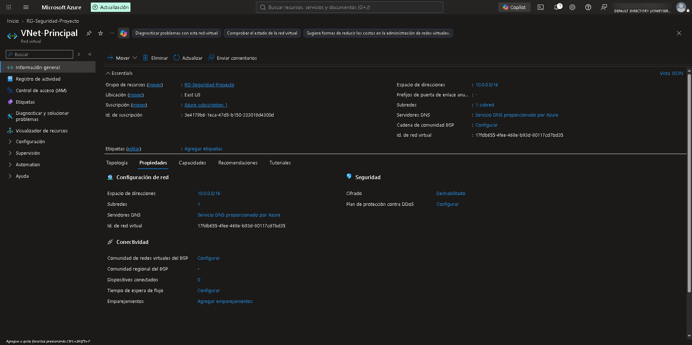
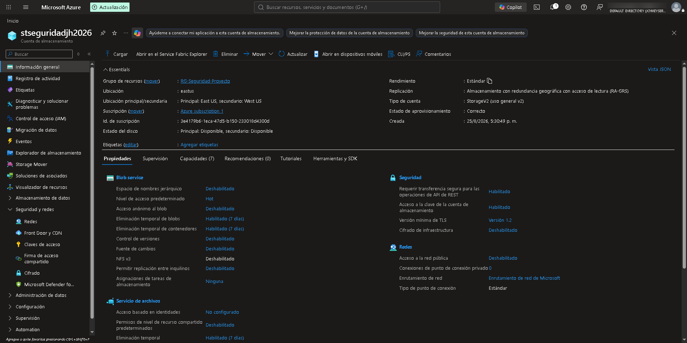
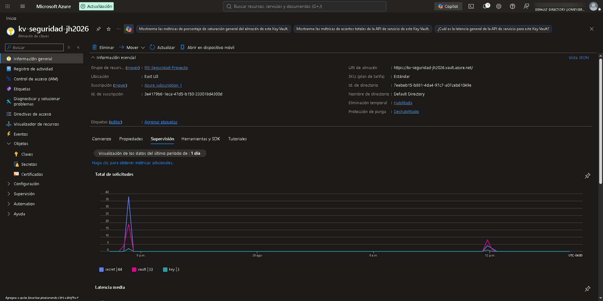
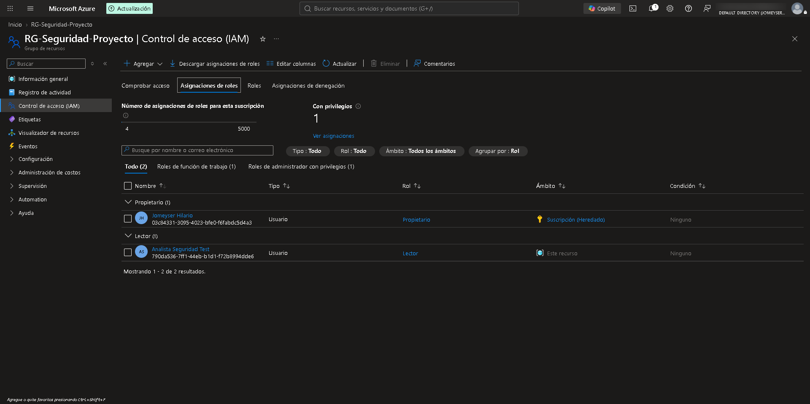

# 🛡️ Azure Zero-Trust Cloud Infrastructure Deployment

## 📌 Overview
Technical documentation for the design, segmentation, and deployment of a secure cloud infrastructure on **Microsoft Azure**, implementing the core principles of the **Zero Trust** model ("Never trust, always verify") and the **Principle of Least Privilege (PoLP)** to mitigate attack vectors and enforce network hyper-segmentation.

---

## 📐 Environment Architecture

* **Resource Group:** `RG-Seguridad-Proyecto` (Region: `East US`)
* **Virtual Network (VNet):** `VNet-Principal` (`10.0.0.0/16`) with segmented subnets.
* **Storage Account:** `stseguridadjh2026` (Enforced TLS 1.2, public access blocked).
* **Key Vault:** `kv-seguridad-jh2026` (Cryptographic secret management with Soft-Delete enabled).

---

## 🛠️ Step-by-Step Implementation

### 1. Governance & Resource Group Setup
Initialization of the `RG-Seguridad-Proyecto` resource group as a logical management container and governance policy assignment point in the `East US` region.

---

### 2. Network Segmentation & Traffic Control (VNet & Subnets)
Deployment of the `10.0.0.0/16` address space and operational layer isolation using dedicated subnets (`Frontend-Subnet`, `Backend-Subnet`, `DB-Subnet`). Network Security Group (NSG) rules were established to restrict inter-subnet traffic exclusively to explicitly authorized ports.

---

### 3. Storage Account Hardening
Implementation and security hardening of the `stseguridadjh2026` storage account:
* **Encryption in transit:** Mandatory enforcement of the **TLS 1.2** protocol.
* **Isolation:** Complete restriction of anonymous public blob access.
* **Network Restrictions:** Storage firewall filtering to limit traffic strictly to authorized IP ranges.

---

### 4. Cryptographic Custody & Secret Management (Azure Key Vault)
Configuration of `kv-seguridad-jh2026` for centralizing secrets, encryption keys, and connection strings.
* Enabled **Soft-Delete** and **Purge Protection** mechanisms to prevent accidental or malicious deletion of cryptographic assets.

---

### 5. Role-Based Access Control (RBAC & Entra ID)
Granular permission assignments to Microsoft Entra ID identities following PoLP:
* `Key Vault Secrets Officer`: Exclusive secret management without granting full Azure resource administration privileges.
* `Storage Blob Data Contributor`: Authenticated token-based object access without sharing primary/secondary master storage keys.

---

## 🚀 Technologies & Tools Used
* **Cloud Provider:** Microsoft Azure
* **Identity & Access Management:** Microsoft Entra ID (RBAC), Azure Key Vault
* **Network Security:** Virtual Networks (VNet), Subnets, Network Security Groups (NSG)
* **Encryption & Hardening:** TLS 1.2/1.3, Soft-Delete, Secret Management
